# MULTI-TENANT AFFILIATE ADVERTISING & TRACKING PLATFORM
## A Full-Stack SaaS Architecture for Performance Marketing

### CHAPTER 1: INTRODUCTION

#### 1.1 Background and Motivation
The digital advertising industry has undergone a paradigm shift, transitioning from traditional impression-driven media buying to performance-driven outcomes such as clicks, qualified leads, application installs, and revenue-generating conversions. This transformation has given rise to robust performance marketing ecosystems where advertisers seek a measurable Return on Ad Spend (ROAS), affiliates (publishers) seek transparent payout logic, and tracking platforms act as neutral, cryptographic orchestration engines between traffic generation and conversion attribution. In this contemporary context, reliable event attribution, low-latency tracking, fraud resistance, and tenant-level data isolation are no longer optional features; they are foundational systemic requirements.

The project implemented and evaluated in this thesis is a Multi-Tenant Affiliate Advertising & Tracking Platform, developed as a full-stack Software-as-a-Service (SaaS) system. The platform is engineered to support multiple independent business entities (tenants), each operating with strictly isolated offers, publishers, advertisers, traffic logs, conversion records, and performance analytics. The backend infrastructure is powered by Node.js, Fastify, MySQL, and Redis, while the frontend is constructed using React.js, Tailwind CSS, and Vite. The resulting solution is designed for high-ingress tracking traffic, asynchronous worker-based processing, and near real-time business reporting.

#### 1.2 Problem Statement
Performance marketing operations involve multiple, independently managed entities: advertisers who create offers and define economic logic, publishers who route traffic via tracking links, and platform operators who monitor conversion consistency. Without a robust, technically sound platform, core business operations become highly error-prone.

Specific operational problems in legacy systems include:
- **Data Loss During Burst Traffic:** Synchronous database writes for click data often lead to dropped requests during traffic spikes.
- **Race Conditions in Attribution:** Conversion approval and rejection become inconsistent when multiple postbacks are fired for the same click identifier.
- **Data Leakage in Shared Environments:** Weak logical isolation in databases can lead to one tenant viewing another tenant's proprietary campaign data.
- **Analytical Lag:** Reporting algorithms that query massive raw event tables cause dashboards to lag, rendering operational decision-making reactive rather than proactive.

#### 1.3 Project Domain: Performance Marketing in SaaS Form
The system operates within the B2B SaaS domain. A defining characteristic of this model is that the platform serves numerous tenants utilizing a single, unified codebase and infrastructure cluster while preserving impenetrable logical separation at runtime.

#### 1.4 Aim and Objectives
**Aim:** To architect, build, and rigorously evaluate a multi-tenant, full-stack affiliate advertising and tracking system capable of microsecond-latency click ingestion, distributed conversion processing, and strict tenant-specific data isolation.

**Objectives:**
- To engineer a role-aware React-based Single Page Application (SPA) for the management of offers, publishers, advertisers, and complex domain entities.
- To develop a high-performance Fastify backend supporting rapid tracking endpoints (/click, /imp, /postback) and secure administrative APIs.
- To implement a decoupled event-driven architecture using Redis Streams.

### CHAPTER 4: SYSTEM ARCHITECTURE

#### 4.1 Architectural Overview
The implemented platform utilizes a multi-layer, event-assisted architecture designed to decouple user-facing latency from heavy database write workloads.

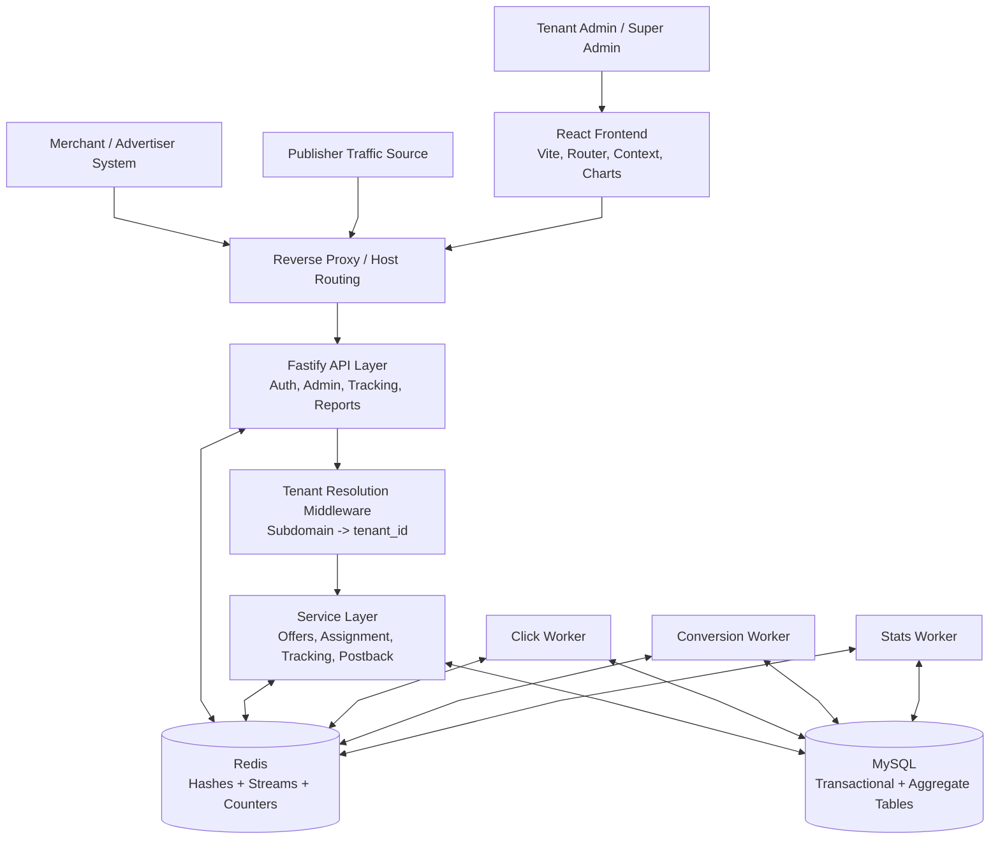
*Figure 4.1: Comprehensive System Architecture bridging Frontend, API, Workers, and Databases.*

#### 4.2 Frontend-Backend Tenant Communication Model
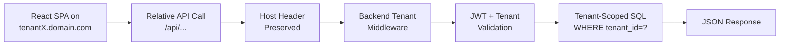
*Figure 4.2: Domain-Driven Request Flow demonstrating host-based context isolation.*

#### 4.3 High-Level Component and Data Flow Diagrams
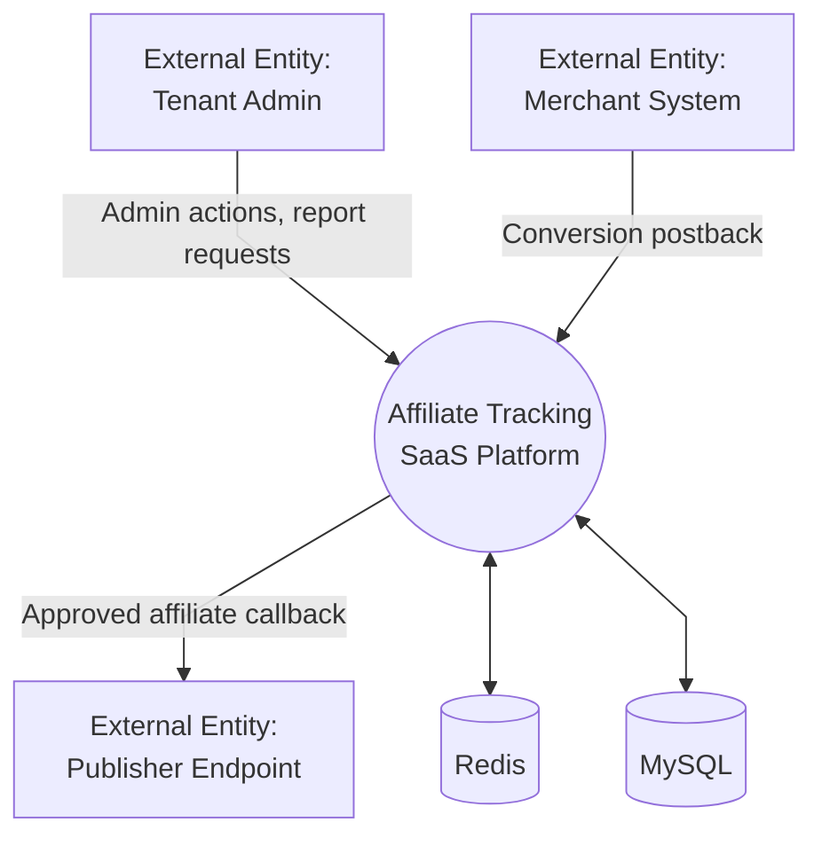
*Figure 4.3: Level-0 Context DFD illustrating core external interactions.*

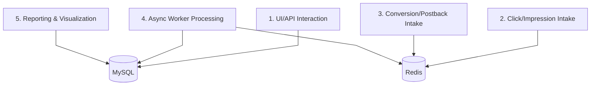
*Figure 4.4: Level-1 DFD detailing subsystem-level interactions with data layers.*

#### 4.4 Tenant Resolution and Isolation Architecture
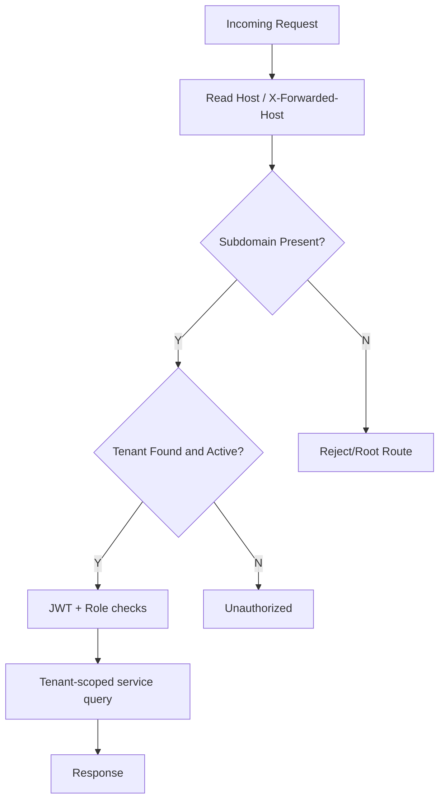
*Figure 4.5: Deterministic Tenant Context Resolution and Authentication Pipeline.*

#### 4.5 End-to-End Conversion Sequence Architecture
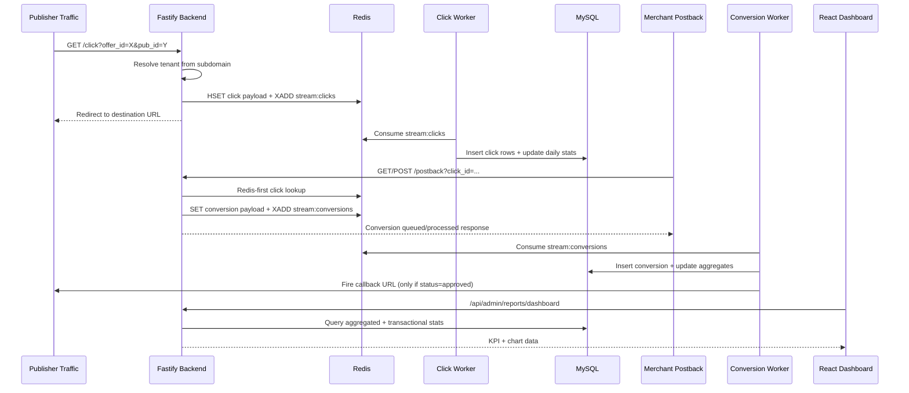
*Figure 4.6: End-to-End Event Sequence Diagram from initial Click ingestion to Analytical Visualization.*

### CHAPTER 5: DATABASE DESIGN AND SCHEMA ENGINEERING

#### 5.3 ER Diagram (Conceptual-Physical Hybrid)
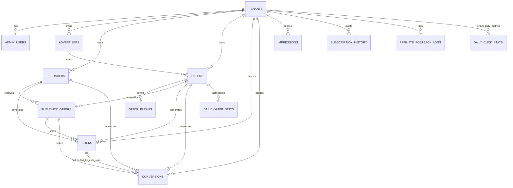
*Figure 5.1: Entity-Relationship Diagram illustrating core domains and tenant scoping.*

### CHAPTER 6: FRONTEND DEVELOPMENT

#### 6.8 Frontend Flow Diagram
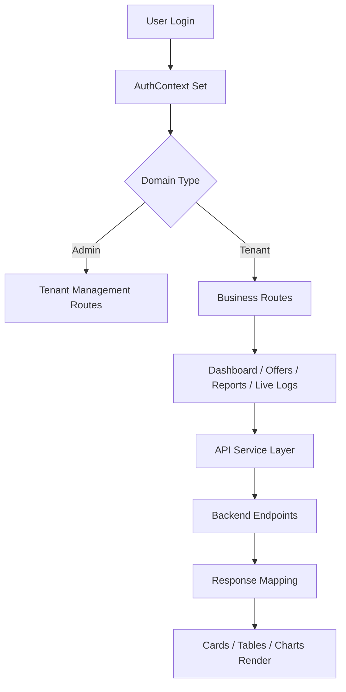
*Figure 6.1: Frontend Routing and State Flow.*

### CHAPTER 7: BACKEND IMPLEMENTATION

#### 7.5 Tracking Link Logic (/click Flow)
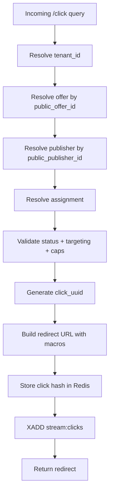
*Figure 7.1: Flowchart detailing the synchronous Click execution path.*

#### 7.6 Postback Engine (/postback Flow)
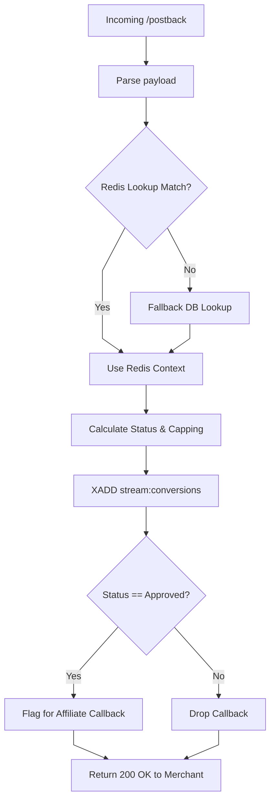
*Figure 7.2: Decoupled and Resilient Postback Processing Logic.*

#### 7.7.3 Stats Worker (statsWorker)
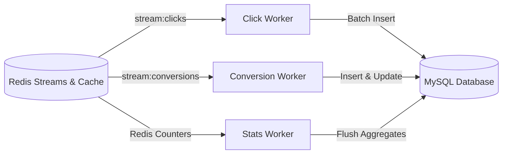
*Figure 7.3: Stream-based Async Worker Topology for high-throughput persistence.*

### CHAPTER 8: SECURITY AND TESTING

#### 8.2 Security Flow Diagram
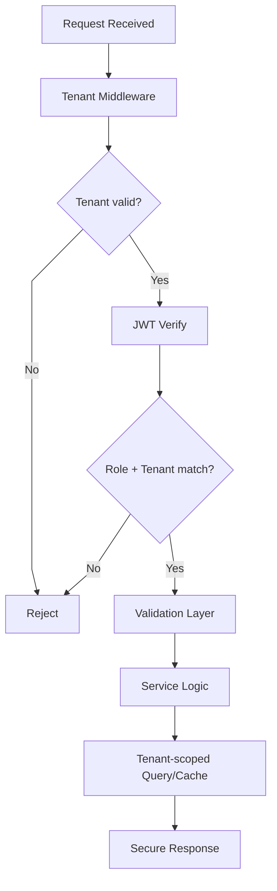
*Figure 8.1: API Authentication and Security Validation Flow.*

### CHAPTER 9: RESULTS, DISCUSSION, AND CONCLUSION
The platform successfully establishes the intended lifecycle:
**Publisher Click -> Backend Validation -> Redis Buffer/Stream -> Worker Persistence -> Merchant Postback -> Conversion Worker -> Approved Callback -> Dashboard Visualization**.
