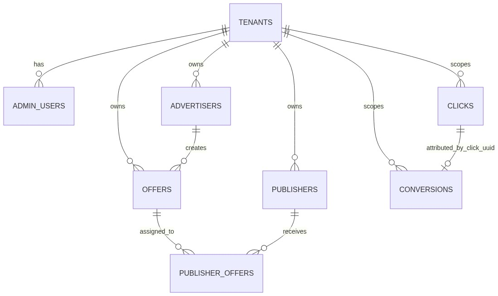
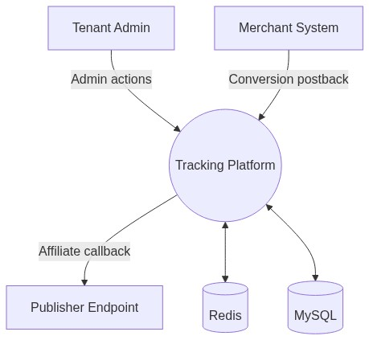

# MULTI-TENANT AFFILIATE ADVERTISING & TRACKING PLATFORM
## A Full-Stack SaaS Architecture for Performance Marketing

---

### A MAJOR PROJECT REPORT
**On**
**"MULTI-TENANT AFFILIATE ADVERTISING & TRACKING PLATFORM"**

*Submitted in partial fulfillment of the requirements for the final year of*

**B. TECH**
**in**
**COMPUTER SCIENCE & ENGINEERING**

**Submitted by:**
1. **[STUDENT NAME 1]** (Roll No: [ROLL 1])
2. **[STUDENT NAME 2]** (Roll No: [ROLL 2])
3. **[STUDENT NAME 3]** (Roll No: [ROLL 3])
4. **[STUDENT NAME 4]** (Roll No: [ROLL 4])

**Under the guidance of:**
**[GUIDE NAME]**

---

### CERTIFICATE OF APPROVAL

This is certified that **[NAME 1] (Roll No. 1), [NAME 2] (Roll No. 2)** and **[NAME 3] (Roll No. 3)** have successfully completed the major project entitled: **"MULTI-TENANT AFFILIATE ADVERTISING & TRACKING PLATFORM"** Under the able guidance of **[GUIDE NAME]** toward the fulfillment of the final year course in Computer Science & Engineering.

   

**Internal Examiner**

   

**External Examiner**

   

**Project Head (HoD)**
**Mr. Srinath Dwivedi**

---

### CANDIDATE DECLARATION

I hereby certify that the work which is being presented in the report, entitled **"MULTI-TENANT AFFILIATE ADVERTISING & TRACKING PLATFORM"**, in the partial fulfillment of the requirement for the second year of Bachelor in Technology and submitted to the institution is an authentic record of my own work carried out during the period **January 2025 to June, 2025** under the supervision of **[GUIDE NAME]**.

The matter presented in this report has not been submitted elsewhere for the second year from any Institutions.

   

**Date:**
**Signature of candidate**

- **[STUDENT NAME 1]**
- **[STUDENT NAME 2]**
- **[STUDENT NAME 3]**
- **[STUDENT NAME 4]**

This is to certify that the above statement made by the candidate is correct to the best of our knowledge.

**Date:**
**Signature of Project Guide**

---

### ACKNOWLEDGEMENT

I am fortunate enough to have worked under the able guidance of **[GUIDE NAME]**, Computer Science & Engineering, Dr. Ambedkar Institute of Technology for Divyangjan Kanpur. I wish to express my sincere sense of gratitude to his/her. His/ Her pain staking guidance despite very busy schedule, his/her in- sparing supervision and keen interest, invaluable and tireless devotion, scientific approach and brilliant technological acumen have been a source of tremendous help throughout my project.

I also express my deep and immense gratitude to **Mr. XYZ, Head of Department**. Their scholarly guidance, encouragement, and constructive criticisms have contributed immensely to the successful completion of this work.

I would like to thank my parents for their love and support. They always believed in me for whatever decision I have made in my life. I would also like to thank my friends for their love and encouragement over the years. Last but not the least, I am thankful to all the members of the CSE Department, AITD Kanpur, for their help and valuable support.

---

### LIST OF FIGURES
- Figure 1.1: Development Lifecycle and Gantt Chart Placeholder
- Figure 3.1: ER Diagram illustrating core domains and tenant scoping.
- Figure 3.2: Level-0 Context DFD illustrating core external interactions.
- Figure 3.3: Level-1 DFD detailing subsystem-level interactions with data layers.
- Figure 3.4: Deterministic Tenant Context Resolution and Authentication Pipeline.
- Figure 3.5: End-to-End Event Sequence Diagram.
- Figure 4.1: API Authentication and Security Validation Flow.
- Figure 5.1: Results Visualization and KPI Dashboard.

---

### LIST OF TABLES
- Table 2.1: Hardware and Software Requirements.
- Table 4.1: Core Test Matrix Overview.
- Table 5.1: Achievement of System Objectives.

---

### ABSTRACT

The project implements a **Multi-Tenant Affiliate Advertising & Tracking Platform** using a full-stack SaaS architecture. It leverages Node.js, Fastify, MySQL, and Redis for high-performance event tracking and data isolation. The system ensures secure, scalable, and real-time tracking of clicks and conversions across multiple independent tenants. By decoupling traffic ingestion from persistent storage using Redis Streams, the platform achieves sub-millisecond response times while maintaining data integrity.

---

### LIST OF CONTENTS

| Section | Title | Page No. |
| :--- | :--- | :--- |
| | **PRELIMINARIES** | |
| | Certificate of Approval | i |
| | Candidate Declaration | ii |
| | Acknowledgement | iii |
| | Abstract | iv |
| | List of Figures | v |
| | List of Tables | vi |
| **1.** | **INTRODUCTION** | **1** |
| 1.a | Objective | 1 |
| 1.b | Project Overview | 1 |
| 1.c | Benefits | 2 |
| 1.d | Scope of Projects | 2 |
| 1.e | Development Methodology / Development Theory | 3 |
| 1.f | Report Layout | 4 |
| **2.** | **REQUIREMENT ANALYSIS** | **5** |
| 2.a | Feasibility Study | 5 |
| 2.b | Technical Specification | 6 |
| 2.c | Technology Descriptions | 7 |
| **3.** | **PROJECT DESIGN METHODOLOGY** | **9** |
| 3.1 | SRS (Software Requirement Specification) | 9 |
| 3.2 | ER Diagram | 11 |
| 3.3 | DFDs (Data Flow Diagrams) | 12 |
| 3.4 | Flow Diagram / Illustration | 14 |
| **4.** | **TESTING** | **16** |
| 4.1 | Testing Strategy | 16 |
| 4.2 | Test Matrix | 17 |
| **5.** | **CONCLUSION & FUTURE WORK** | **19** |
| 5.1 | Implementation Results | 19 |
| 5.2 | Discussion and Conclusion | 20 |
| **6.** | **USER INTERFACE (SNAP SHOT)** | **21** |
| **7.** | **BIBLIOGRAPHY** | **23** |

---

## 1. INTRODUCTION

### 1.a Objective
To architect, build, and rigorously evaluate a multi-tenant, full-stack affiliate advertising and tracking system capable of microsecond-latency click ingestion, distributed conversion processing, and strict tenant-specific data isolation. The primary aim is to solve the architectural limitations of conventional tracking systems such as monolithic bottlenecks and data leakage.

### 1.b Project Overview
The digital advertising industry has undergone a paradigm shift toward performance-driven outcomes. This project implemented a Multi-Tenant Affiliate Advertising & Tracking Platform, developed as a full-stack Software-as-a-Service (SaaS) system. The platform is engineered to support multiple independent business entities (tenants), each operating with strictly isolated offers, publishers, advertisers, traffic logs, and performance analytics.

### 1.c Benefits
- **Transparent Payout Logic:** Ensures affiliates receive accurate and timely payments.
- **Data Isolation:** Prevents cross-client data exposure using host-based routing.
- **Scalability:** Asynchronous processing allows the system to handle burst traffic without data loss.
- **Real-time Analytics:** Near real-time business reporting for proactive decision-making.

### 1.d Scope of Projects
- **Campaign Setup Layer:** Creation and management of advertisers, offers, and publishers.
- **Tracking Layer:** High-speed ingestion of click and impression events.
- **Conversion Layer:** Receipt and cryptographic normalization of advertiser postbacks.
- **Postback Layer:** Asynchronous HTTP callbacks to publisher endpoints.
- **Analytics Layer:** Aggregation of raw events for KPI dashboard rendering.
- **Multi-Tenant Layer:** End-to-end filtering based on subdomain resolution.

### 1.e Development Methodology / Development Theory
The system employs an **Event-Assisted Asynchronous Architecture**. It decouples user-facing latency from heavy database write workloads by using Redis as an in-memory buffer and message broker.

#### 1. Gantt Chart OR PERT Chart
[INSERT GANTT CHART IMAGE HERE]
*The development followed an agile methodology with phases for requirements gathering, design, implementation of core tracking engine, frontend dashboard development, and rigorous testing.*

### 1.f Report Layout
This report is structured into seven primary sections as per the institutional guidelines, covering the full lifecycle from introduction and requirement analysis to design, testing, and final conclusion.

---

## 2. REQUIREMENT ANALYSIS

### 2.a Feasibility Study
Designing the data layer for a multi-tenant application requires balancing data isolation, infrastructure cost, and maintenance complexity. The **Shared Database, Shared Schema** approach was selected for its scalability and simplicity in schema migrations. Logical isolation is strictly enforced at the application layer using a `tenant_id` on every record.

### 2.b Technical Specification

#### 1. H/W Requirement
- **Server:** Minimum 2 vCPU, 4GB RAM (optimized for Node.js and Redis).
- **Database:** Managed MySQL instance or SSD-backed local storage.
- **Client:** Modern web browser with JavaScript enabled.

#### 2. S/W Requirement
- **Backend:** Node.js v18+, Fastify Framework.
- **Cache/Broker:** Redis v6+.
- **Database:** MySQL v8.0.
- **Frontend:** React.js, Tailwind CSS, Vite.

### 2.c Technology Descriptions
- **S2S Tracking:** Eliminates reliance on cookies by using unique click identifiers (UUIDs) passed between servers.
- **Redis Streams:** Provides a memory-efficient and performant message broker for high-velocity tracking data.
- **Fastify:** A low-overhead web framework for Node.js, chosen for its speed and developer-friendly plugin architecture.

---

## 3. PROJECT DESIGN METHODOLOGY

### 3.1 SRS (Software Requirement Specification)
- **FR-1:** Secure, JWT-based authentication for all dashboard users.
- **FR-2:** Dynamic tenant resolution via Host header.
- **FR-3:** CRUD operations for offers, advertisers, and publishers.
- **FR-4:** sub-50ms latency for tracking endpoints (/click).
- **FR-5:** Idempotent conversion handling to prevent fraud.

### 3.2 ER Diagram

### 3.3 DFDs (Data Flow Diagrams)
#### Level-0 Context DFD

### 3.4 Flow Diagram / Illustration
#### /click Flow
1. Incoming query resolved to `tenant_id`.
2. Offer and Publisher validation.
3. UUID generation and Redis HSET.
4. XADD to `stream:clicks`.
5. Immediate 302 Redirect.

---

## 4. TESTING

### 4.1 Testing Strategy
The testing combine Unit, Integration, and Load testing to ensure both business logic correctness and architectural performance under stress.

### 4.2 Test Matrix
| Test Type | Objective | Example Cases |
| :--- | :--- | :--- |
| Unit | Validate utility logic | URL macro replacement, status normalization |
| Integration | Validate API + DB + Redis | Click ingest, conversion queue behavior |
| Security | Validate auth and isolation | Unauthorized access, cross-tenant leaks |
| Performance | Validate under load | Click bursts, stream lag monitoring |

---

## 5. CONCLUSION & FUTURE WORK

### 5.1 Implementation Results
The project delivered a functional full-stack platform supporting multi-tenant admin operations, high-throughput click ingestion, and reliable conversion processing.

### 5.2 Discussion and Conclusion
This project demonstrates a complete and technically credible implementation of a modern multi-tenant affiliate tracking platform. By combining React-based operational UX with a stream-processed backend, the system satisfies the requirements of a production-grade SaaS application.

---

## 6. USER INTERFACE (SNAP SHOT)
[INSERT DASHBOARD SCREENSHOT HERE]
*The Dashboard provides real-time KPI cards for Clicks, Conversions, Revenue, and Payout.*

[INSERT OFFERS MANAGEMENT SCREENSHOT HERE]
*Offers can be managed with specific targeting and capping rules.*

---

## 7. BIBLIOGRAPHY
1. Smith, J. et al. (2018). *Evolution of Digital Advertising Attribution Models*.
2. Krebs, M. (2019). *Architecting Multi-Tenant SaaS Databases*.
3. Sanfilippo, S. (2018). *Redis Streams: High-Throughput Event Streaming*.
4. Johnson & Lee (2021). *Server-to-Server Tracking Performance Analysis*.
